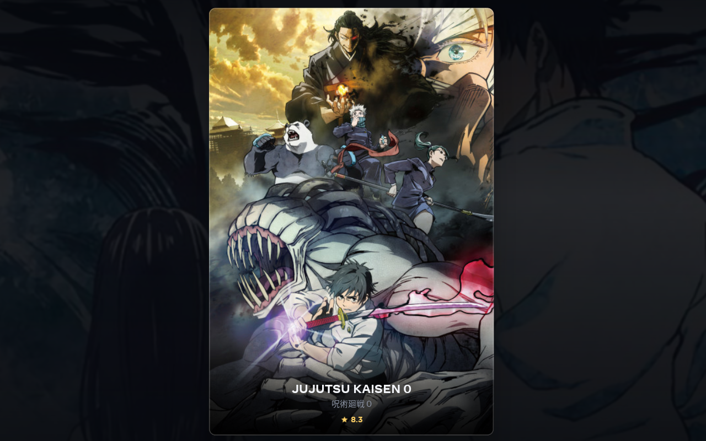
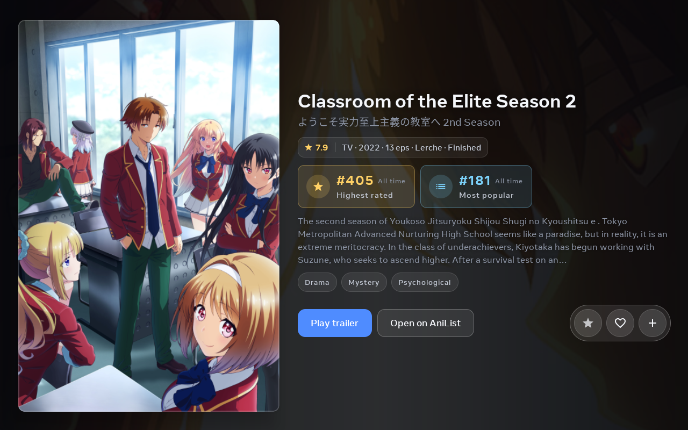
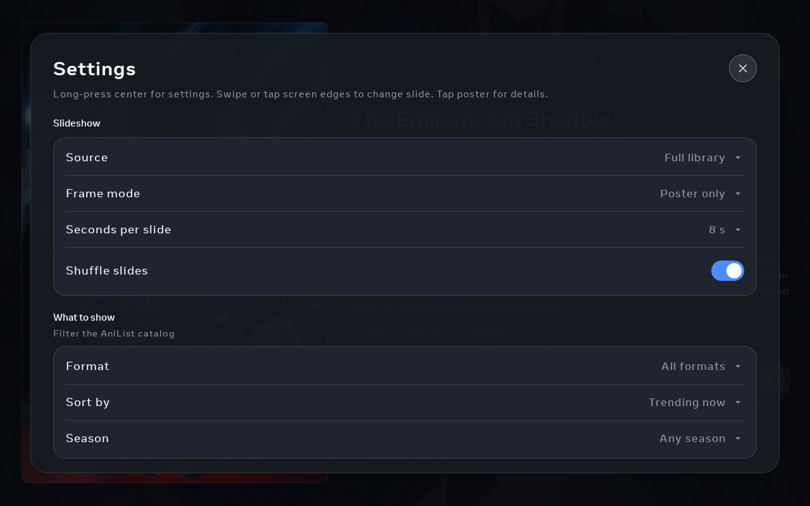

[](https://scanaislop.com/hoandesign/portalani)
[](https://github.com/hoandesign/portalani/actions/workflows/ci.yml)

# Portal Ani

AniList-powered anime screensaver for **Meta Portal**. Fullscreen landscape slideshow with cover art, rankings, trailers, optional clock and weather, weekly airing calendar, and optional AniList sign-in.

Inspired by [portal-gphotos](https://github.com/ram-nat/portal-gphotos).

**Package:** `com.portal.portalani`  
**Version:** 0.11.1

## Features

- **Poster mode** (default) — large centered poster with Ken-Burns parallax; tap to **flip** and reveal full details; long-press poster or center for settings
- **Informative mode** — poster plus synopsis, genres, rankings, and actions side by side; optional compact clock and weather at the top-right
- **Calendar mode** — weekly airing grid (Mon–Sun or Sun–Sat): cover, episode label, English title, and local air time; swipe or tap edges for other weeks; tap a poster for animated detail (same layout as informative mode); list anime prioritized
- **Clock & weather** — optional time, date, and current conditions from [Open-Meteo](https://open-meteo.com/) (°C/°F, city search or device location). **Poster mode:** large overlay at bottom-left. **Informative mode:** smaller overlay at top-right. Hidden while poster detail is open.
- **Personal** — your AniList lists (watching, planning, completed, …); select multiple lists; narrow with format, country, source material, and demographic filters
- **Full library** — browse the catalog with season, format, country, source material, demographic, and sort filters
- **Hide Hentai genre** — optional content filter (on by default) for slideshow and calendar
- AniList OAuth (rate, favourite, add to list), YouTube trailers, offline cache
- Shuffle, slide interval, and power/sleep options
- Registers as Portal idle screensaver (`DreamService`)

## Quick start

1. Follow **[docs/SETUP.md](docs/SETUP.md)** — AniList OAuth app, build, and Portal deploy.
2. Build: `GRADLE_OPTS="-Xmx2g" ./gradlew assembleDebug`
3. Deploy: `bash scripts/deploy.sh --build`

## Testing

Run unit tests (filters, season encoding, calendar math, cache JSON, AniList parsing, coordinators, OAuth, network retry):

```bash
GRADLE_OPTS="-Xmx4g" ./gradlew test
```

**107 JVM unit tests** across the data layer, `SlideshowFeedLoader`, `CalendarCoordinator`, `AniListSessionHandler`, and `MainViewModel` behavioral paths.

**3 Compose UI smoke tests** (`androidTest`) — settings sheet, format filter dialog (Apply/Close visible), list status scroll.

```bash
GRADLE_OPTS="-Xmx4g" ./gradlew connectedDebugAndroidTest
```

**CI** (badge above): every push/PR runs `./gradlew test assembleDebug assembleRelease`. A second job runs the Compose smoke tests on an API 29 landscape emulator (informational; does not block merge if flaky).

**Production hardening:** see [docs/PRODUCTION-READINESS.md](docs/PRODUCTION-READINESS.md), [docs/AUDIT-2026-06-16.md](docs/AUDIT-2026-06-16.md), and [AGENTS.md](AGENTS.md).

**Release APK (R8 minify):** see [docs/RELEASE.md](docs/RELEASE.md).

## Gestures on Portal

| Action | Poster / Informative | Calendar |
|--------|----------------------|----------|
| **Next** | Swipe left or tap right edge | Swipe left or tap right edge (next week) |
| **Previous** | Swipe right or tap left edge | Swipe right or tap left edge (previous week) |
| **Settings** | Long-press center (or poster in poster mode) | Long-press center, day header, month title, or any poster |
| **Detail** | Tap poster (poster mode flip) | Tap poster — expands to same layout as informative mode |
| **Today** | — | Tap **Today** (top right) |

On first launch, subtle on-screen hints walk through swipe, hold-for-settings, and (in poster mode) tap-poster. They fade away after you try each gesture or after a short pause.

### Calendar mode

- Seven columns for the current week (starts **Monday** by default; switch to **Sunday** in Settings).
- Header shows month/year (from the week’s Monday); **Today** jumps back to the current week.
- Posters use a fixed **460 × 610** portrait ratio everywhere (calendar, poster, informative modes).
- Episode line shows **Ep N ·  Title** (spaced after the dot) with local air time below (e.g. `8:00 PM`).
- Swipe down on the week grid to scroll tall days together.
- **Personal** source: only anime on your selected lists. **Full library**: all airing anime matching filters.
- **What’s on the grid:** every episode AniList schedules for that week. There is **no season picker** and **no status filter** (finished shows with a final episode still appear if AniList lists them for that week).
- **Filters that still apply:** format (TV, movie, OVA, …), country of origin, source material (manga, light novel, …), demographic (shounen, seinen, …), sort order, **Hide Hentai**, and (in Personal mode) your selected lists.
- **Detail view:** poster animates from the grid card into the left slot; info panel fades in with stable layout (no jump when full AniList data loads). Same 32dp padding as poster/informative modes.
- Settings shows **Season** as **This week’s airings** (read-only) while in calendar mode — use the content filters and **Sort** under **What to show** instead.
- No auto-advance timer — browse weeks manually.

### Clock & weather behavior

| Frame mode | Clock position | Size |
|------------|----------------|------|
| **Poster** | Bottom-left | Large (time 48sp) |
| **Informative** | Top-right | Compact (time 30sp) |
| **Calendar** | Hidden | — |

- Toggle in **Settings → Clock & weather** — same **Show clock** / **Show weather** switches for poster and informative modes.
- Poster mode hides the clock while the poster detail flip is open; informative mode keeps it visible.
- Weather needs a location: **Use my location** (one-time permission) or search for a city.
- Weather data refreshes periodically while the app is running; no API key required.

### What to show — filters by source

| Filter | Personal (slideshow) | Personal (calendar) | Full library (slideshow) | Full library (calendar) |
|--------|----------------------|---------------------|--------------------------|-------------------------|
| Lists | Yes | Yes | — | — |
| Format | Yes (on device) | Yes (on device) | Yes (AniList API) | Yes (on device) |
| Country | Yes (on device) | Yes (on device) | Yes (on device) | Yes (on device) |
| Source material | Yes (on device) | Yes (on device) | Yes (AniList API) | Yes (on device) |
| Demographic | Yes (on device) | Yes (on device) | Yes (on device) | Yes (on device) |
| Sort | List order | Yes | Yes | Yes |
| Season | — | — | Yes | — (this week only) |
| Hide Hentai | Yes | Yes | Yes | Yes |

Personal mode loads your lists from AniList, then applies content filters on the device. Full library can also pre-filter source material via the AniList API; country and demographic are always matched on the device after fetch.

**Filter pickers:** Format, country, source, demographic, and list-status dialogs are centered on screen, scroll when the list is long, and keep **Close** / **Apply** visible at the bottom. Country options show flag emojis (e.g. 🇯🇵 Japan).

## Security

- `local.properties` holds your AniList client secret (gitignored).
- OAuth tokens live in app private storage on the Portal.
- Location is used only for weather lookup when you enable it; coordinates are stored locally with your place label.
- Use `adb install -r` when updating; uninstall only if you want to clear sign-in.

## Screenshots

Captured on Meta Portal (1280×800 landscape).







## License

MIT — see [LICENSE](LICENSE).
