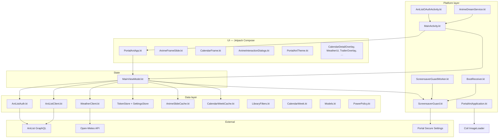

# Portal Ani — Architecture & Risk Audit

**Date:** 2026-06-16  
**Version audited:** 0.9.34 (`versionCode` 82)  
**Auditor:** Phase 0 inventory (no code changes)  
**Build:** `GRADLE_OPTS="-Xmx2g" ./gradlew assembleDebug` — **BUILD SUCCESSFUL** (2026-06-18)

---

## Executive summary

Portal Ani is a working Meta Portal screensaver app (~40 Kotlin files, ~11.5k LOC) built as a single-module Compose app. Core product flows (slideshow, calendar, OAuth, offline cache, DreamService screensaver) are implemented and the debug build compiles cleanly.

The main engineering risk is **maintainability without a safety net**: zero unit or instrumentation tests, no CI, a 1,200-line ViewModel that owns network + GPS + weather + caching + OAuth, and manual `org.json` parsing with no golden fixtures. Release builds have minify disabled and ProGuard rules are empty.

**Recommendation:** Do **tests-first** (Tier 1 JVM unit tests on `data/`), then CI, then targeted refactors. Do not split god files until tests exist.

---

## Architecture map

### High-level component diagram



### Current vs target layering

| Layer | Today | Target (incremental) |
|-------|-------|----------------------|
| UI | `PortalAniApp` + frame/dialog composables; 30+ callbacks into VM | Same, but settings panel extracted after tests |
| ViewModel | `MainViewModel` — orchestration **and** HTTP, GPS, cache I/O, pagination | Thin orchestration only |
| Repository | **Missing** — VM calls clients/stores directly | `AnimeRepository`, `CalendarRepository`, `WeatherRepository` |
| Clients / stores | `AniListClient`, `AniListAuth`, `WeatherClient`, `*Cache`, `TokenStore` | Unchanged; parsing extracted for testability |

### File inventory by concern

| Area | Key files | LOC | Notes |
|------|-----------|-----|-------|
| UI shell | `ui/PortalAniApp.kt` | 1,482 | God composable: routing, slideshow, settings (~720 lines), filter rows |
| UI frames | `AnimeFrameSlide.kt`, `CalendarFrame.kt`, `CalendarDetailOverlay.kt` | 867 + 724 + 205 | Rich Portal layouts; reasonably scoped |
| UI dialogs | `AnimeInteractionDialogs.kt`, `WeatherLocationDialog.kt` | 1,062 + 171 | Shared `PortalCenteredDialog` / `portalDialogSurface`; filter dialogs use `MultiSelectFilterDialog` |
| State | `MainViewModel.kt` | 1,201 | Owns OkHttp, all stores, feed + calendar + weather + OAuth |
| Network | `AniListClient.kt`, `AniListAuth.kt`, `WeatherClient.kt` | 788 + 82 + 62 | GraphQL via OkHttp; `postGraphQl` throws `IOException` on errors |
| Persistence | `TokenStore.kt`, `AnimeSlideCache.kt`, `CalendarWeekCache.kt` | 219 + 190 + 128 | SharedPreferences + JSON files under `filesDir` |
| Domain | `LibraryFilters.kt`, `CalendarWeek.kt`, `Models.kt` | 606 + 197 + 249 | **Highly testable** pure Kotlin |
| Platform | `AnimeDreamService.kt`, `ScreensaverGuard.kt`, `MainActivity.kt` | 36 + 120 + 193 | DreamService → MainActivity; guard re-asserts screensaver |
| Build / deploy | `app/build.gradle.kts`, `scripts/deploy.sh` | — | Secrets → `BuildConfig`; deploy grants `WRITE_SECURE_SETTINGS` |

### Data flow (slideshow)

1. `MainViewModel.init` → `ScreensaverGuard.applyNow` + `refresh()` (`MainViewModel.kt:153–157`)
2. `loadSlides()` builds `cacheKey` from `AppSettings.cacheKey()` (`Models.kt:228–238`)
3. Try fresh cache → stale cache → AniList fetch (`MainViewModel.kt:951–1025`)
4. Client-side filter via `LibraryFilters.matchesSlide` (`LibraryFilters.kt:304–318`)
5. On success, persist to `AnimeSlideCache`; on failure, fall back to stale (`AnimeSlideCache.kt:27–38`, `MainViewModel.kt:1026–1040`)

### Data flow (calendar)

1. `frameMode == CALENDAR` → `loadCalendarWeek()` (`MainViewModel.kt:162–171`)
2. Memory LRU (16 weeks) → disk cache → AniList `fetchAiringSchedules` (`MainViewModel.kt:140–142`, `813–849`)
3. Filter/sort via `CalendarWeek.matchesContentFilters` / `sortEntries` (`CalendarWeek.kt:154–174`)
4. Adjacent weeks prefetched (`MainViewModel.kt:881`)

### Data flow (OAuth)

1. `signIn()` → `AniListOAuthActivity` WebView (`MainViewModel.kt:274–294`, `AniListOAuthActivity.kt:29`)
2. Redirect `portalani://callback` → `MainActivity` intent filter (`AndroidManifest.xml:31–38`)
3. `handleOAuthCallback` validates state, exchanges code (`MainViewModel.kt:297–333`)
4. Token in `TokenStore` SharedPreferences (`TokenStore.kt:6–16`)

---

## Confirmed gaps (evidence)

| Gap | Evidence |
|-----|----------|
| **Zero unit tests** | No files under `app/src/test/`; `./gradlew test` → `compileDebugUnitTestKotlin NO-SOURCE` |
| **Zero instrumentation tests** | No files under `app/src/androidTest/` |
| **No CI** | No `.github/workflows/` directory |
| **Release minify off** | `app/build.gradle.kts:35` — `isMinifyEnabled = false` |
| **Empty ProGuard rules** | `app/proguard-rules.pro` — comment only |
| **Manual JSON** | `org.json` in `AniListClient.kt`, `AnimeSlideCache.kt`, `CalendarWeekCache.kt`, `WeatherClient.kt`, `AniListAuth.kt` |
| **Test deps unused** | `app/build.gradle.kts:67–71` — JUnit, Espresso, Compose UI test declared, never used |
| **Secrets in APK** | `ANILIST_CLIENT_SECRET` → `BuildConfig` (`app/build.gradle.kts:28–29`) — standard for mobile OAuth confidential clients, but secret is embedded in binary |

---

## Risks

### P0 — High impact / regression or ship risk

| # | Risk | Location | Impact |
|---|------|----------|--------|
| R1 | **No automated tests** — filter, calendar, cache, or parse regressions ship silently | repo-wide | Any refactor or AniList schema drift breaks device behavior undetected |
| R2 | **God ViewModel** — 50+ public/private methods mixing I/O, UI state, GPS, timers | `MainViewModel.kt:85–1201` | High coupling; hard to reason about reload vs pagination vs calendar prefetch |
| R3 | **Crash on corrupt settings prefs** — bare `valueOf` without `runCatching` | `TokenStore.kt:59`, `:76`, `:96`, `:113` | Bad/migrated pref string → `IllegalArgumentException` on cold start |
| R4 | **No CI** | — | Broken builds merge unnoticed; no gate before Portal deploy |
| R5 | **AniList parse fragility** — 500+ lines of `JSONObject` field access, no fixtures | `AniListClient.kt:303–481` | API shape change → null slides or thrown `IOException` with raw error blob |

### P1 — Important maintainability / security

| # | Risk | Location | Impact |
|---|------|----------|--------|
| R6 | **Broad `catch (Exception)`** — swallows I/O, JSON, and logic errors alike | `MainViewModel.kt:203`, `:330`, `:760`, `:855`, `:1026` | Users see generic messages; root cause lost (no logging except ScreensaverGuard) |
| R7 | **Silent cache parse failure** — corrupt JSON → `null`, no user signal | `AnimeSlideCache.kt:16–24`, `CalendarWeekCache.kt:36–48` | Offline mode silently empty; only network retry helps |
| R8 | **Release not hardened** — no R8, empty keep rules | `build.gradle.kts:35`, `proguard-rules.pro` | Larger APK; OAuth/Compose/DreamService untested under shrinker |
| R9 | **`allowBackup="true"`** with OAuth token in default SharedPreferences | `AndroidManifest.xml:14`, `TokenStore.kt:7` | Device backup/restore may expose tokens (low likelihood on Portal, still worth ruling out) |
| R10 | **Duplicate enum deserialization** — `runCatching { valueOf }` copy-pasted across filter enums and stores | `LibraryFilters.kt:40,105,171,220`, `TokenStore.kt:70`, `AnimeSlideCache.kt:119,179` | Drift when adding enum values; inconsistent migration |
| R11 | **Three OkHttpClient instances** — VM, Coil, no shared config | `MainViewModel.kt:86–90`, `PortalAniApplication.kt:14–18` | Redundant connection pools; harder to add logging/interceptors later |
| R12 | **WebView JS enabled** — OAuth + YouTube trailers | `AniListOAuthActivity.kt:33`, `TrailerOverlay.kt:36` | Acceptable for AniList/YouTube only; document threat model |
| R13 | **No network retry** — single attempt per GraphQL call | `AniListClient.kt:470–480` | Transient Portal Wi‑Fi blips → error UI or stale cache only |
| R14 | **Screensaver race** — Portal launcher can overwrite `screensaver_components` | `ScreensaverGuard.kt:16–23` | Documented; periodic worker mitigates but last app wins |

### P2 — Quality / slop (fix when tested)

| # | Risk | Location | Impact |
|---|------|----------|--------|
| R15 | **God composables** — settings panel ~720 lines inside `PortalAniApp` | `PortalAniApp.kt:721–1442` | Hard to navigate; duplicate picker patterns |
| R16 | **God dialogs file** — 1k lines mixing chrome + 6 filter dialogs + score UI | `AnimeInteractionDialogs.kt` | Legitimate richness, but extraction blocked without UI tests |
| R17 | **Magic dp/sp** scattered vs `PortalAniTheme.kt` (491 LOC) | various `ui/*` | Portal 1280×800 tuning opaque to new contributors |
| R18 | **`PortalAniApp` uses bare `valueOf` on settings keys** | `PortalAniApp.kt:1241,1254,1267,1306,1385` | Assumes well-formed keys from radio groups — low risk |
| R19 | **Comment noise / dead imports** | not exhaustively audited | Minor; clean during focused edits only |
| R20 | **No `docs/RELEASE.md`** | — | Signing and release process undocumented |

### Sacred behaviors (do not regress)

Verified against `README.md`, `docs/SETUP.md`, and manifest:

- Landscape-only (`AndroidManifest.xml:25`, `:44`)
- DreamService screensaver + deploy script secure-settings grant (`AnimeDreamService.kt`, `scripts/deploy.sh`)
- OAuth redirect `portalani://callback` (`build.gradle.kts:30`, manifest intent-filter)
- Offline cache with stale fallback (`AnimeSlideCache.loadStale`, `MainViewModel.kt:1026–1029`)
- Personal vs library filter split (API vs device) — `LibraryFilters.kt`, `README.md` filter table
- Calendar: no season picker; week grid only (`README.md` calendar section)

---

## Testability assessment

### Tier 1 — Ready for JVM unit tests now (no Android context)

| Module | Functions / types | Suggested test class |
|--------|-------------------|----------------------|
| `LibraryFilters.kt` | `matchesSlide`, `matchesCalendarEntry`, filter `encode`/`decode`, `hideHentai` | `LibraryFiltersTest` |
| `SeasonSelection` | `resolve`, `encode`/`decode`, picker normalization, year edge cases | `SeasonSelectionTest` |
| `CalendarWeek` | `startOfWeek`, `groupByDay`, `sortEntries`, `parseAiringDate` | `CalendarWeekTest` |
| `isoCountryFlagEmoji` | valid/invalid ISO | `CountryFlagTest` |
| `AnimeSlideCache` | JSON round-trip helpers (`toJson` / `toAnimeSlide`) | `AnimeSlideCacheTest` |
| `CalendarWeekCache` | JSON round-trip | `CalendarWeekCacheTest` |
| `AniListClient` | `parseMedia`, `parseMediaPage`, `parseAiringSchedule` — **needs `internal` or test fixture extraction** | `AniListClientParseTest` |

### Tier 2 — Needs fakes + coroutines test

- `MainViewModel`: settings change → reload path; OAuth error → `NeedsSetup`; filter change → `orderResetToken`; calendar week navigation

### Tier 3 — Selective Compose UI

- Settings sheet open; filter dialog Apply/Close; `ListStatusDialog` scroll (v0.9.34 regression)

---

## Prioritized backlog

### P0 — Do first (blocks production-ready v1)

| ID | Item | Addresses | Effort |
|----|------|-----------|--------|
| P0-1 | Add JVM unit tests: `LibraryFilters`, `SeasonSelection`, `CalendarWeek`, flag emoji | R1 | M |
| P0-2 | Add cache JSON round-trip tests (`AnimeSlideCache`, `CalendarWeekCache`) | R1, R7 | S |
| P0-3 | Harden `SettingsStore.load()` — wrap all `valueOf` in safe parse with defaults | R3 | S |
| P0-4 | GitHub Actions: `./gradlew test assembleDebug` on push/PR | R4 | S |
| P0-5 | Extract `parseMedia` / `parseAiringSchedule` to testable visibility + golden JSON fixtures | R5 | M |

### P1 — Next wave (after P0 tests green)

| ID | Item | Addresses | Effort |
|----|------|-----------|--------|
| P1-1 | `MainViewModel` behavioral tests with fake client + stores | R2 | L |
| P1-2 | Narrow `catch (Exception)` → `IOException` + domain errors; log in debug | R6 | M |
| P1-3 | Enable R8 + ProGuard keep rules (Compose, OAuth, DreamService, `BuildConfig`) | R8 | M |
| P1-4 | Consolidate enum `decodeSelection` helpers (single module-level or per-enum) | R10 | S |
| P1-5 | Add `docs/RELEASE.md` (signing via env, not committed) | R20 | S |
| P1-6 | Assess `allowBackup` + `backup_rules.xml` to exclude auth prefs | R9 | S |
| P1-7 | Optional: shared OkHttp client via `Application` or small DI | R11 | S |

### P2 — After safety net exists

| ID | Item | Addresses | Effort |
|----|------|-----------|--------|
| P2-1 | Split `PortalAniApp` settings panel into `SettingsPanel.kt` | R15 | M |
| P2-2 | Split `AnimeInteractionDialogs.kt` by dialog family | R16 | M |
| P2-3 | Introduce thin repository layer (incremental, one domain at a time) | R2 | L |
| P2-4 | Centralize or document Portal 1280×800 dp constants | R17 | S |
| P2-5 | Compose UI smoke tests with `testTag` on key controls | — | M |
| P2-6 | Detekt or ktlint (auto-fix only, no style bikeshed) | R19 | S |
| P2-7 | Network retry with backoff for idempotent reads | R13 | M |

---

## Suggested PR sequence (pending Hoan approval)

1. **docs:** this audit (no behavior change) ← *you are here*
2. **test:** Tier 1 pure Kotlin (`LibraryFilters`, `SeasonSelection`, `CalendarWeek`)
3. **test:** cache round-trips + AniList parse fixtures
4. **fix:** safe `SettingsStore` enum loading (P0-3)
5. **ci:** GitHub Actions workflow
6. **test:** `MainViewModel` critical paths
7. **build:** release minify + ProGuard rules
8. **refactor:** split settings UI / extract repository (only with tests green)

---

## Build verification log

```text
$ GRADLE_OPTS="-Xmx2g" ./gradlew assembleDebug
BUILD SUCCESSFUL in 5s

$ GRADLE_OPTS="-Xmx2g" ./gradlew test
compileDebugUnitTestKotlin NO-SOURCE
testDebugUnitTest NO-SOURCE
BUILD SUCCESSFUL
```

APK output: `app/build/outputs/apk/debug/app-debug.apk`

---

## Decision needed from Hoan

Pick a priority track before Phase 1 edits:

| Track | First PRs | Best if… |
|-------|-----------|----------|
| **A — Tests-first** (recommended) | P0-1 → P0-2 → P0-5 → P0-3 | You want filter/calendar bugs caught before more features |
| **B — CI-first** | P0-4 → P0-1 | You want merge gates immediately, tests follow |
| **C — Hardening-first** | P0-3 → P1-3 | Portal deploy stability worries you more than test coverage |

**No refactors** to god files or new frameworks until you approve a track.

---

*Next agent: start Phase 1 only after Hoan picks A/B/C.*
