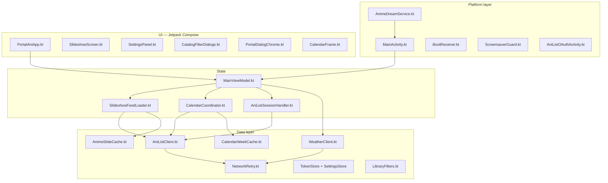

# Portal Ani — Architecture & Risk Audit

**Original audit:** 2026-06-16 (Phase 0 inventory)  
**Last updated:** 2026-06-19  
**Version at original audit:** 0.9.34 (`versionCode` 82)  
**Current version:** 0.11.1 (`versionCode` 90)  
**Build:** `GRADLE_OPTS="-Xmx2g" ./gradlew test assembleDebug` — **BUILD SUCCESSFUL** (2026-06-19)

> **For agents:** This document started as a pre-hardening snapshot. Sections below mark what is **done** vs **still open** as of v0.11.1. Do not treat the original executive summary or P0 backlog as current blockers — most P0/P1 items are closed.

---

## Executive summary (current)

Portal Ani is a working Meta Portal screensaver (~45 Kotlin source files) with slideshow, calendar, OAuth, offline cache, and DreamService screensaver registration.

**Since the original audit (2026-06-16 → 2026-06-19):**

| Area | Was | Now |
|------|-----|-----|
| Unit tests | 0 | **107** JVM tests (`app/src/test/`) |
| UI smoke tests | 0 | **3** Compose tests (`app/src/androidTest/`) |
| CI | None | GitHub Actions: `test` + debug/release APKs; emulator UI job (API 29 landscape) |
| Release minify | Off | **R8 on** with `proguard-rules.pro` keep rules |
| `MainViewModel` | ~1,200 lines, all concerns | **~680 lines**; feed/calendar/OAuth in `vm/*` coordinators |
| `PortalAniApp` | ~1,500-line god composable | **~223 lines** shell; settings in `SettingsPanel.kt` |
| Network retry | None | `NetworkRetry.kt` on read-only GraphQL/weather calls |
| Filter dialogs | Could clip footer off-screen | Fixed-height dialog + pinned **Close** / **Apply** (v0.11.1) |

**Remaining engineering risk:** `MainViewModel` still owns weather/geolocation and user-action mutations; `org.json` parsing remains manual; `allowBackup` not reviewed; emulator CI job uses `continue-on-error: true`.

**Recommendation for next work:** Use the app on Portal, fix user-reported bugs with tests, or pick items from **Open backlog** below — not a full rewrite.

---

## Architecture map (v0.11.1)

### High-level component diagram



### Current vs target layering

| Layer | Today (v0.11.1) | Target (incremental) |
|-------|-----------------|----------------------|
| UI | `PortalAniApp` shell + `SettingsPanel`, `CatalogFilterDialogs`, frame composables | Stable; add `testTag` only where UI tests need it |
| ViewModel | `MainViewModel` — settings, weather, user actions, delegates feed/calendar/OAuth | Thin orchestration; extract weather/location |
| Coordinators | `SlideshowFeedLoader`, `CalendarCoordinator`, `AniListSessionHandler` | **Done** for slideshow/calendar/OAuth |
| Repository | Still missing — coordinators call clients/stores directly | Optional thin repos per domain |
| Clients / stores | `AniListClient`, caches, `TokenStore`, `NetworkRetry` | Unchanged; more golden JSON fixtures welcome |

### File inventory by concern (updated LOC)

| Area | Key files | LOC (approx) | Notes |
|------|-----------|--------------|-------|
| UI shell | `ui/PortalAniApp.kt` | 223 | Routing shell only |
| UI settings | `ui/SettingsPanel.kt` | 807 | Extracted from former god composable |
| UI filters | `ui/CatalogFilterDialogs.kt`, `ui/ListStatusDialogs.kt` | — | Split from `AnimeInteractionDialogs.kt` |
| UI dialogs | `ui/AnimeInteractionDialogs.kt`, `ui/PortalDialogChrome.kt` | 442 + — | Shared chrome; pinned footer for filter pickers |
| State | `MainViewModel.kt` | 682 | Weather, geo, user mutations remain |
| Coordinators | `vm/SlideshowFeedLoader.kt`, `vm/CalendarCoordinator.kt`, `vm/AniListSessionHandler.kt` | — | Feed pagination, calendar week, OAuth |
| Network | `AniListClient.kt`, `NetworkRetry.kt`, `WeatherClient.kt` | — | Retry on idempotent reads |
| Domain | `LibraryFilters.kt`, `EnumParsing.kt`, `CalendarWeek.kt` | — | Shared `decodeCommaSeparatedEnumSelection` |
| Build / deploy | `app/build.gradle.kts`, `.github/workflows/ci.yml`, `scripts/deploy.sh` | — | R8 release; CI on push/PR |

### Data flow (slideshow) — current

1. `MainViewModel.refresh()` → `loadSlides()` delegates to **`SlideshowFeedLoader.loadSlides()`**
2. Cache fresh → stale → AniList fetch; filter via `LibraryFilters.matchesSlide`
3. Pagination via `SlideshowFeedLoader.onSlideIndexChanged()`
4. Session expiry → **`AniListSessionHandler`** via `onSessionExpired` callback

### Data flow (calendar) — current

1. `frameMode == CALENDAR` → **`CalendarCoordinator`** (`loadWeek`, `shiftWeek`, `navigateToWeek`)
2. Memory LRU → disk cache → AniList airing schedules
3. Filter/sort via `CalendarWeek` helpers

### Data flow (OAuth) — current

1. `signIn()` / `handleOAuthCallback()` → **`AniListSessionHandler`**
2. Redirect `portalani://callback`; tokens in `TokenStore`

---

## Gap status (original vs now)

| Original gap | Status | Evidence |
|--------------|--------|----------|
| Zero unit tests | **Done** | 15 test classes, 107 `@Test` methods; `./gradlew test` runs them |
| Zero instrumentation tests | **Done** | `PortalAniComposeSmokeTest.kt` — 3 smoke tests |
| No CI | **Done** | `.github/workflows/ci.yml` — `build` + `emulator-ui-tests` jobs |
| Release minify off | **Done** | `isMinifyEnabled = true`; `proguard-rules.pro` has keep rules |
| Manual JSON, no fixtures | **Partial** | `AniListJsonParserTest` + fixtures under `src/test/resources/anilist/`; more coverage possible |
| Test deps unused | **Done** | JUnit, coroutines-test, Robolectric, Compose UI test in use |
| God ViewModel (~1.2k LOC) | **Partial** | ~682 LOC; feed/calendar/OAuth extracted; weather/geo remain |
| God `PortalAniApp` | **Done** | Shell + `SettingsPanel.kt` |
| No network retry | **Done** | `NetworkRetry.kt` + `NetworkRetryTest.kt` |
| Broad `catch (Exception)` in VM | **Partial** | User actions use `IOException` / `JSONException`; coordinators use narrowed catches |
| `allowBackup` + tokens | **Open** | `AndroidManifest.xml` still `allowBackup="true"`; no `backup_rules.xml` |
| Duplicate enum `valueOf` | **Partial** | `EnumParsing.kt` + `EnumParsingTest`; `SettingsStoreTest` for corrupt prefs |
| No `docs/RELEASE.md` | **Done** | `docs/RELEASE.md` |
| Emulator CI blocks merge | **Open** | `emulator-ui-tests` has `continue-on-error: true` |
| Secrets in APK (`BuildConfig`) | **Accepted** | Standard for confidential OAuth mobile clients; document only |

---

## Risks (updated)

### Mitigated since original audit

| # | Was | Mitigation |
|---|-----|------------|
| R1 | No automated tests | 107 JVM + 3 UI smoke tests; CI runs `test` |
| R2 | God ViewModel | Coordinators extracted; VM ~45% smaller |
| R3 | Crash on corrupt settings | `parseAppSettings` + `SettingsStoreTest` corrupt-key cases |
| R4 | No CI | GitHub Actions on push/PR |
| R5 | Parse fragility | `AniListJsonParserTest` + golden JSON |
| R6 | Broad `catch (Exception)` | Narrowed in VM user actions + coordinator PRs |
| R8 | Release not hardened | R8 + ProGuard rules validated in CI `assembleRelease` |
| R13 | No network retry | `NetworkRetry` on read-only calls |
| R15 | Settings in `PortalAniApp` | `SettingsPanel.kt` |
| R16 | God dialogs file | Split: `CatalogFilterDialogs`, `ListStatusDialogs`, `PortalDialogChrome` |
| R20 | No release docs | `docs/RELEASE.md` |

### Still open

| # | Risk | Location | Suggested next step |
|---|------|----------|---------------------|
| R7 | Silent cache parse failure | `*Cache.kt` | Log in debug; optional user badge when parse fails |
| R9 | `allowBackup` + OAuth prefs | `AndroidManifest.xml` | `backup_rules.xml` excluding auth prefs |
| R10 | Enum decode drift | `EnumParsing.kt` | Extend tests when adding filter enum values |
| R11 | Multiple OkHttp clients | VM, Coil, clients | Shared client via `Application` (low priority) |
| R17 | Magic dp/sp | `ui/*` | Document Portal 1280×800 constants |
| R19 | Detekt / ktlint | — | Optional; auto-fix only |
| — | VM still owns weather/GPS | `MainViewModel.kt` | Extract `WeatherCoordinator` when adding tests |
| — | Emulator CI non-blocking | `ci.yml` | Remove `continue-on-error` when stable |

### Sacred behaviors (do not regress)

Unchanged from original audit — verify on Portal after changes:

- Landscape-only; DreamService + `scripts/deploy.sh` secure settings
- OAuth `portalani://callback`
- Offline cache with stale fallback
- Personal vs library filter split (API vs device)
- Calendar: week grid only; filter pickers with **pinned Close/Apply** footer

---

## Test coverage (v0.11.1)

### JVM unit tests (`app/src/test/`)

| Test class | Covers |
|------------|--------|
| `LibraryFiltersTest` | Filter matching, encode/decode, hideHentai |
| `SeasonSelectionTest` | Season picker encode/decode |
| `CalendarWeekTest` | Week boundaries, grouping, sort |
| `CountryFlagTest` | ISO flag emoji |
| `AnimeSlideCacheTest`, `CalendarWeekCacheTest` | JSON round-trips |
| `AniListJsonParserTest` | Golden AniList JSON fixtures |
| `EnumParsingTest`, `SettingsStoreTest` | Safe enum/pref parsing |
| `NetworkRetryTest` | Retry backoff on `IOException` |
| `SlideshowFeedLoaderTest` | Feed load, cache fallback, session expiry |
| `CalendarCoordinatorTest` | Week navigation, cache |
| `AniListSessionHandlerTest` | OAuth flows |
| `MainViewModelTest`, `ViewModelErrorsTest` | VM reload paths, errors |

### Instrumentation (`app/src/androidTest/`)

| Test | Covers |
|------|--------|
| `SettingsSheetSmokeTest` | Error → open settings sheet |
| `FilterDialogSmokeTest` | Format filter; **Apply** visible |
| `ListStatusDialogSmokeTest` | List status scroll |

CI: `build` job runs JVM tests; `emulator-ui-tests` runs `connectedDebugAndroidTest` on API 29 landscape.

---

## Backlog status

### P0 — original “blocks production-ready v1”

| ID | Item | Status |
|----|------|--------|
| P0-1 | JVM tests: filters, season, calendar, flags | **Done** |
| P0-2 | Cache JSON round-trip tests | **Done** |
| P0-3 | Harden `SettingsStore.load()` | **Done** (`SettingsStoreTest`, `EnumParsing.kt`) |
| P0-4 | GitHub Actions CI | **Done** |
| P0-5 | AniList parse fixtures | **Done** (`AniListJsonParserTest`) |

### P1 — next wave

| ID | Item | Status |
|----|------|--------|
| P1-1 | MainViewModel behavioral tests | **Done** (`MainViewModelTest`, coordinator tests) |
| P1-2 | Narrow exception handling | **Partial** — user actions + coordinators; audit remaining `Throwable` paths |
| P1-3 | R8 + ProGuard | **Done** |
| P1-4 | Consolidate enum decode | **Partial** — `EnumParsing.kt`; extend as needed |
| P1-5 | `docs/RELEASE.md` | **Done** |
| P1-6 | `allowBackup` / backup rules | **Open** |
| P1-7 | Shared OkHttp client | **Open** (low priority) |

### P2 — after safety net

| ID | Item | Status |
|----|------|--------|
| P2-1 | Split settings from `PortalAniApp` | **Done** (`SettingsPanel.kt`) |
| P2-2 | Split filter/list dialogs | **Done** (`CatalogFilterDialogs`, `ListStatusDialogs`) |
| P2-3 | Thin repository layer | **Open** |
| P2-4 | Document Portal dp constants | **Open** |
| P2-5 | Compose UI smoke tests | **Done** (+ CI emulator job) |
| P2-6 | Detekt / ktlint | **Open** |
| P2-7 | Network retry | **Done** |

---

## Completed PR sequence (2026-06-16 → 2026-06-19)

1. Architecture audit (this doc)
2. Tier 1 JVM tests + cache fixtures
3. Safe settings parsing + enum helpers
4. GitHub Actions CI
5. MainViewModel / coordinator tests
6. Release minify + ProGuard
7. Split `PortalAniApp` / settings / dialogs / dialog chrome
8. Extract `CalendarCoordinator`, `AniListSessionHandler`, `SlideshowFeedLoader`
9. Network retry for read-only API calls
10. CI emulator UI tests + pinned filter dialog footers
11. Documentation refresh (README, SETUP, RELEASE, AGENTS)

---

## Recommended next steps (2026-06-19)

| Priority | Task | Effort |
|----------|------|--------|
| 1 | **Use on Portal** — note bugs; fix with tests | Ongoing |
| 2 | Tag release `v0.11.1` on GitHub | S |
| 3 | `backup_rules.xml` — exclude auth SharedPreferences | S |
| 4 | Make emulator CI job merge-blocking (remove `continue-on-error`) | S |
| 5 | Extract weather/location from `MainViewModel` | M |
| 6 | New product feature (only if the user wants it) | varies |

---

## Build verification log (2026-06-19)

```text
$ GRADLE_OPTS="-Xmx2g" ./gradlew test assembleDebug
BUILD SUCCESSFUL

$ find app/src/test -name '*Test.kt' | wc -l
15

$ grep -r '@Test' app/src/test --include='*Test.kt' | wc -l
107
```

APK: `app/build/outputs/apk/debug/app-debug.apk`  
Deploy: `bash scripts/deploy.sh --build`

---

*Maintainers: update **Last updated**, **Current version**, and backlog **Status** columns when closing items — do not leave P0 items marked open once shipped.*
